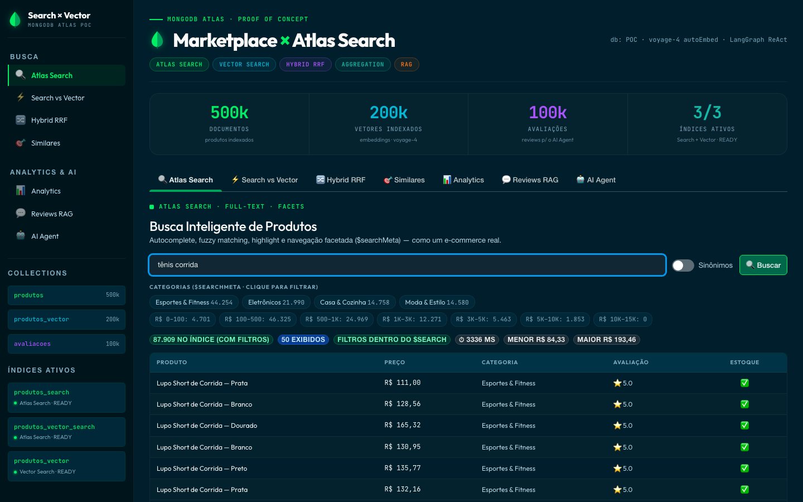
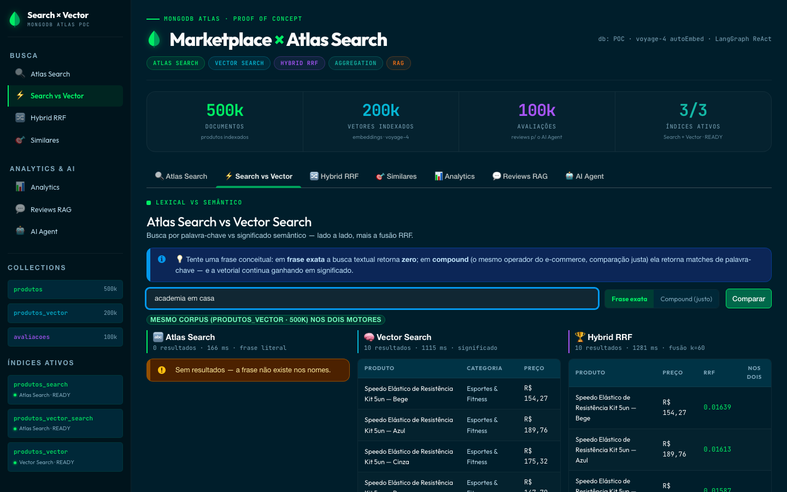
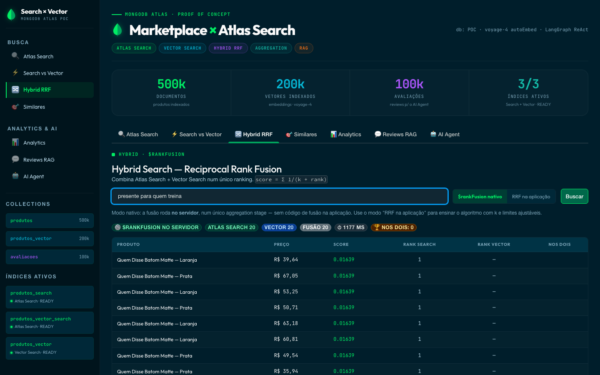
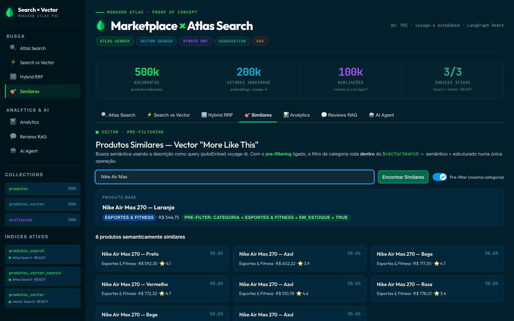
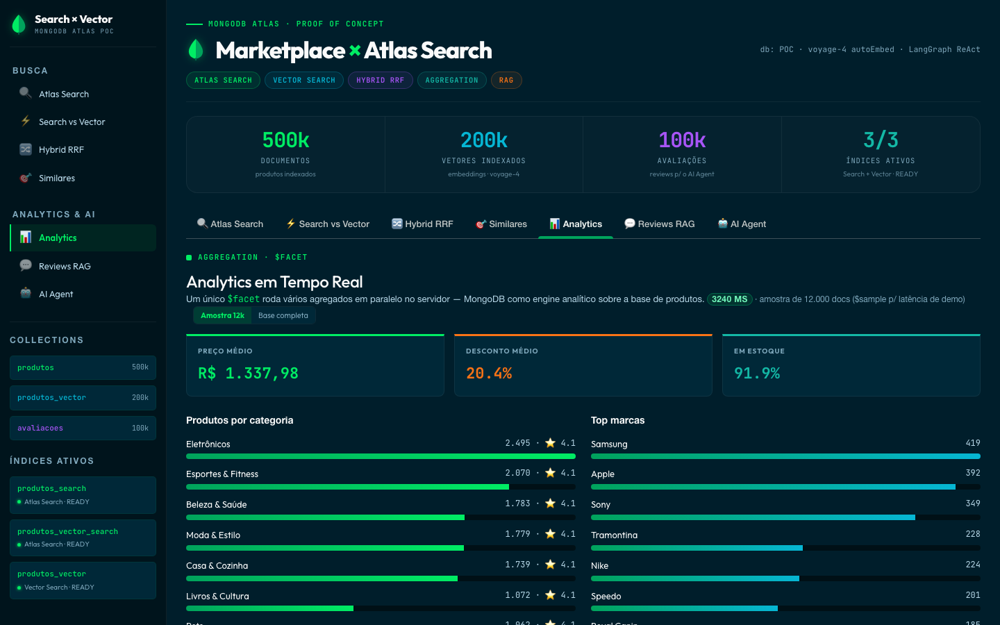
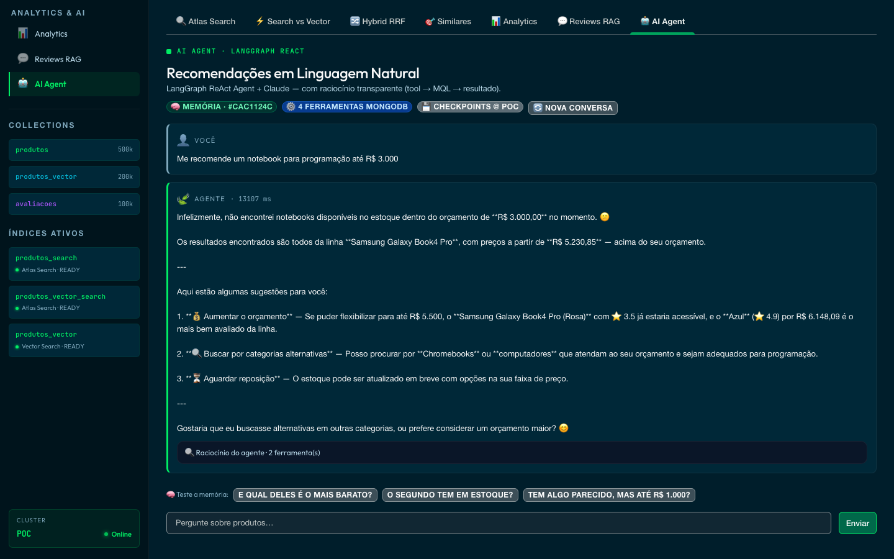

# Search & AI Agent POC — MongoDB Atlas

A technical proof of concept showing how MongoDB Atlas can serve as the complete
backend for search and AI workloads. It combines full-text search, semantic
(vector) search, hybrid ranking, real-time analytics, RAG, and a tool-using AI
agent over a synthetic marketplace catalog — all on a single platform.

The demo is configurable for any dataset through environment variables
(`MONGODB_URI`, `DB_NAME`).



## Architecture

```
React + LeafyGreen  ──axios──►  FastAPI  ──►  MongoDB Atlas
  (frontend/ :5273)             (backend/ :8200)      (POC)
```

| Layer       | Technology                                              |
|-------------|---------------------------------------------------------|
| UI          | React 18 + Vite + LeafyGreen (MongoDB design system)    |
| API         | FastAPI (`backend/`)                                    |
| AI agent    | LangGraph (ReAct pattern)                               |
| LLM         | Claude Sonnet 4.6 (Anthropic)                           |
| Embeddings  | Voyage AI `voyage-4` via Atlas autoEmbed                |
| Database    | MongoDB Atlas 8.0+                                       |
| Agent memory| `MongoDBSaver` — checkpoints keyed by `thread_id`       |

## Features

The UI is organized into seven tabs, each demonstrating a distinct Atlas capability.

**Atlas Search** — Full-text search over the product catalog: autocomplete,
fuzzy matching (`"adidass"` → Adidas), clickable faceted navigation via
`$searchMeta` (category chips + price buckets), native highlighting, total
match counts, compound queries, `scoreDetails` relevance transparency, and an
optional synonym mapping. When the index supports it, price/stock/category
filters run inside `$search` (`compound.filter`) so the match count reflects
the filters; otherwise the app falls back to a post-`$match` and flags it.

**Search vs Vector** — Side-by-side comparison of lexical search and semantic
search, with two lexical modes: *exact phrase* (conceptual queries such as
`"academia em casa"` return **zero**) and *compound* (the same e-commerce
operator from tab 1 — a fair baseline that still loses to vector search on
meaning). Each engine reports its own latency.

**Hybrid RRF** — Two engines, switchable in the UI: the native `$rankFusion`
stage (MongoDB 8.1+, fusion happens server-side in a single aggregation) and
an application-side Reciprocal Rank Fusion (`score = Σ 1 / (k + rankᵢ)`) with
adjustable `k` and per-engine result counts, kept as the educational view.
When `$rankFusion` requirements aren't met, the app falls back gracefully and
says why. Fusion is keyed by `produto_id`.

**Similares** — Vector "more like this" using a product's description as the
query, with native pre-filtering: the category and stock filters run inside
`$vectorSearch` rather than as a post-processing step.

**Analytics** — A single `$facet` pipeline runs several aggregations in parallel
on the server, positioning MongoDB as an analytical engine over the catalog.
Defaults to a 12k `$sample` for demo latency, with a toggle to run the same
pipeline over the full collection and compare timings.

**Reviews RAG** — A real `$search` query finds the most relevant product that
has reviews, the reviews are pulled from MongoDB, and Claude summarizes them
grounded strictly in that data. The executed pipelines are shown in the UI.

**AI Agent** — A LangGraph ReAct agent with four MongoDB tools
(`busca_semantica`, `buscar_produto`, `comparar_categoria`,
`produtos_por_faixa_preco`), long-term memory via `MongoDBSaver` (with
follow-up suggestions that exercise the thread memory), and a transparent
trace: the pipelines shown in the UI are built by the same functions the
tools execute — byte-for-byte what ran.

## Screenshots

| | |
|---|---|
| **Search vs Vector** — exact phrase returns zero, semantic search understands the intent | **Hybrid RRF** — native `$rankFusion` running server-side |
|  |  |
| **Similares** — vector "more like this" with pre-filtering inside `$vectorSearch` | **Analytics** — parallel `$facet` aggregations over the catalog |
|  |  |

**AI Agent** — LangGraph ReAct agent with MongoDB tools and a transparent MQL trace:



## Collections

```
POC (database)
├── produtos          Product catalog (20M)  — Atlas Search index: produtos_search
├── produtos_vector   Embedded subset (500K) — Vector Search index: produtos_vector (voyage-4)
│                                            — Atlas Search index: produtos_vector_search
├── avaliacoes        Product reviews         — used by Reviews RAG and the agent
└── checkpoints       LangGraph agent memory
```

> **Why a 500K subset for vectors?** Auto-embedding 20M descriptions is a
> deliberate cost/build-time decision, not a platform limitation — the subset
> is a representative `$sample` of the catalog. The extra lexical index on
> `produtos_vector` (`produtos_vector_search`) exists so hybrid search runs
> both engines over the **same corpus**, which native `$rankFusion` requires
> (its sub-pipelines target a single collection). The app detects available
> indexes via `$listSearchIndexes` and degrades gracefully when one is missing.

## Setup

### Prerequisites

- MongoDB Atlas cluster 8.0+ (8.1+ for native `$rankFusion` in the Hybrid tab;
  on 8.0 the app falls back to application-side RRF and flags it)
- Anthropic API key (Claude)
- Python 3.11+ and Node 18+

### Environment variables

Create a `.env` file at the repository root:

```env
MONGODB_URI=mongodb+srv://<user>:<password>@<cluster>.mongodb.net/
DB_NAME=POC
ANTHROPIC_API_KEY=sk-ant-...
```

### Search indexes (one-time)

With the `.env` in place, apply the index changes the demo expects — patches
`produtos_search` (filterable types) and creates `produtos_vector_search`
(same-corpus hybrid / native `$rankFusion`), idempotently:

```bash
python3 setup_search_indexes.py           # apply + wait for READY
python3 setup_search_indexes.py --status  # check build progress later
```

The app degrades gracefully while indexes are building or missing — the UI
badges show which fallback is active.

### Run (backend + frontend)

```bash
bash start.sh
```

Then open http://localhost:5273. Ports are configurable:
`BACKEND_PORT=8201 FRONTEND_PORT=5274 bash start.sh`.

### Run manually (two terminals)

```bash
# Terminal 1 — backend
cd backend && pip install -r requirements.txt && uvicorn main:app --port 8200

# Terminal 2 — frontend
cd frontend && npm install && npm run dev
```

See [`frontend/README.md`](frontend/README.md) and
[`backend/README.md`](backend/README.md) for component-level details.

## Configuring synonyms in the Atlas UI

The synonyms toggle in the Atlas Search tab relies on a mapping named
`sinonimos_produtos` on the `produtos_search` index.

1. Atlas UI → cluster → Atlas Search → `produtos_search` → Synonyms →
   Add synonym mapping.
2. Name: `sinonimos_produtos`; source collection: `sinonimos`; analyzer:
   `lucene.portuguese`.
3. Insert the following documents into the `sinonimos` collection (Atlas UI or
   Compass):

```json
[
  { "mappingType": "equivalent", "synonyms": ["notebook", "laptop", "computador portátil"] },
  { "mappingType": "equivalent", "synonyms": ["tênis", "calçado esportivo", "sneaker"] },
  { "mappingType": "equivalent", "synonyms": ["celular", "smartphone", "telefone"] },
  { "mappingType": "equivalent", "synonyms": ["fone", "headphone", "fone de ouvido", "earphone"] },
  { "mappingType": "equivalent", "synonyms": ["tv", "televisão", "televisor"] },
  { "mappingType": "equivalent", "synonyms": ["geladeira", "refrigerador", "frigobar"] },
  { "mappingType": "equivalent", "synonyms": ["academia", "musculação", "ginástica"] },
  { "mappingType": "explicit", "input": ["presente"], "synonyms": ["kit", "combo", "caixa"] }
]
```

The index rebuilds after the mapping is saved (about two minutes). The toggle
shows a notice if the index is still building.

> Note: the application UI is intentionally in Portuguese, since the demo
> targets a Brazilian audience.

## Project structure

```
.
├── frontend/                 React 18 + Vite + LeafyGreen
│   ├── src/tabs/             One component per feature tab
│   └── src/components/       Sidebar, KpiCard, ProductTable, Leaf
├── backend/                  FastAPI
│   ├── atlas.py              MongoDB connection and pipelines (search, vector, RRF, facets)
│   ├── agent.py              LangGraph ReAct agent and MQL trace reconstruction
│   ├── reviews.py            Reviews RAG summarization
│   └── main.py               REST routes, CORS, request models
├── populate_marketplace.py   Generates the synthetic catalog and reviews
├── start.sh                  Launches backend and frontend together
└── README.md
```

The repository also contains a separate Streamlit transaction-profiler demo
(`app.py`, `populate_profiler.py`); it is independent of the marketplace POC.

## Stack


