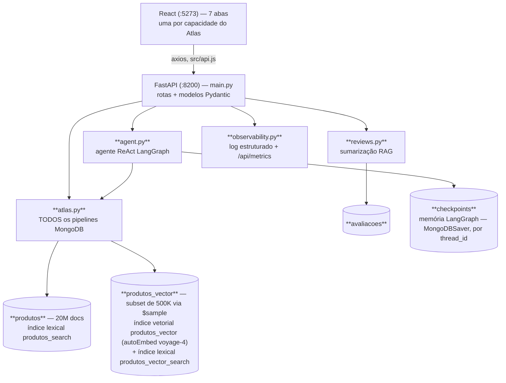
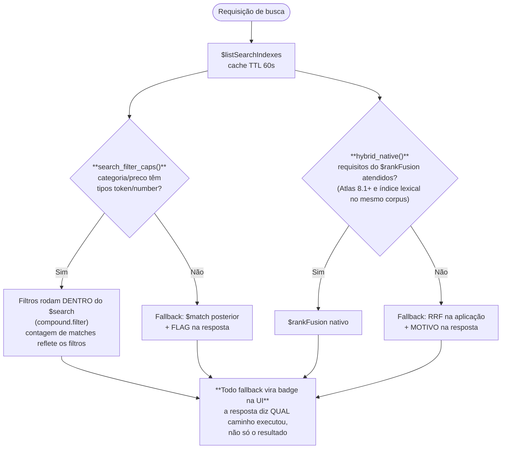
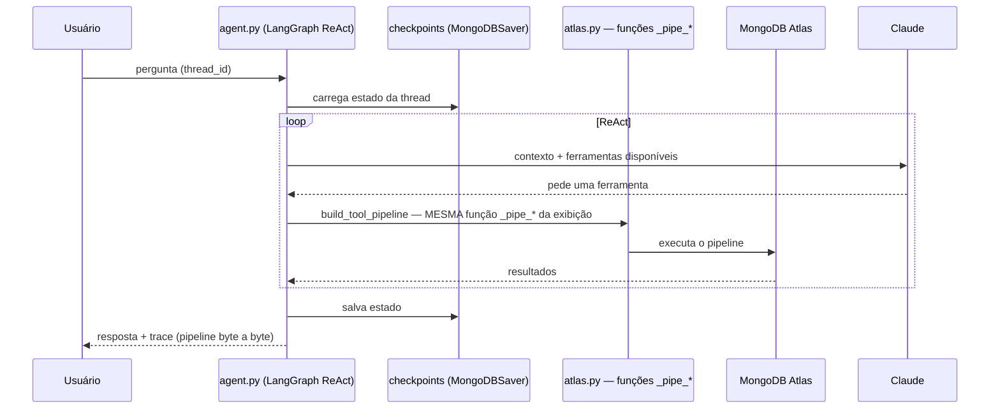

# Atlas Search × Vector Search — Marketplace com Agente ReAct

PoC de Atlas Search e Vector Search sobre um catálogo sintético de marketplace: **busca full-text, busca semântica (vetorial), ranqueamento híbrido (`$rankFusion` nativo + RRF do lado da aplicação), analytics, RAG de avaliações e um agente ReAct em LangGraph.**

Frontend React com 7 abas — uma por capacidade do Atlas — sobre FastAPI, sobre MongoDB Atlas.

A tese: você não precisa de um motor de busca separado do banco, nem de um vector DB separado do motor de busca. Os três são o mesmo cluster, e as sete abas provam capacidade por capacidade.

Textos de UI em português (público brasileiro); código, comentários e documentação em inglês. Nomes de coleção e campo em português (`produtos`, `avaliacoes`, `preco`, `categoria`).

---

## 1. Arquitetura

```
frontend/src/tabs/*.jsx ──axios (src/api.js)──► backend/main.py (rotas, modelos Pydantic)
                                                   ├── atlas.py           todos os pipelines MongoDB
                                                   ├── agent.py           agente ReAct LangGraph
                                                   ├── reviews.py         sumarização RAG
                                                   └── observability.py   log estruturado + /api/metrics
```



---

## 2. Duas coleções, por necessidade do `$rankFusion`

Esta é a decisão de modelagem que mais gera pergunta, então vale explicar direto:

- `produtos` — **20M documentos**, com índice lexical `produtos_search`.
- `produtos_vector` — subset de **500K** obtido por `$sample`, com índice vetorial `produtos_vector` (Atlas autoEmbed, voyage-4) **mais um índice lexical `produtos_vector_search`**.

Por que o índice lexical extra numa coleção que existe para busca vetorial? Porque **o `$rankFusion` nativo exige que os dois sub-pipelines rodem na mesma coleção**. Sem o lexical em `produtos_vector`, não há híbrido nativo — só RRF na aplicação.

O subset de 500K existe porque vetorizar 20M documentos num PoC não agrega ao argumento e custa caro. A demo de busca lexical roda contra os 20M inteiros; a de vetorial e híbrida, contra o subset. Isso é dito na tela.

- `avaliacoes` — avaliações, para RAG e para o agente.
- `checkpoints` — memória do LangGraph (`MongoDBSaver`, chaveada por `thread_id`).

---

## 3. Degradação graciosa — o padrão central

`backend/atlas.py` **inspeciona os índices vivos** via `$listSearchIndexes` (cache com TTL de 60s) e se adapta no momento da requisição, em vez de assumir estado de índice.



**Ao adicionar feature, retornar qual caminho executou — não só os resultados.** Um PoC que esconde que caiu no fallback está mentindo por omissão, e mentira desse tipo é descoberta na pergunta seguinte do cliente.

Diferença prática entre filtro dentro do `$search` e `$match` posterior, que vale explicar em demo: **com filtro dentro do `$search`, a contagem de matches reflete o filtro.** Com `$match` posterior, você filtra o que já veio ranqueado — a contagem mente e a paginação piora.

---

## 4. Transparência de MQL — o segundo padrão central

**Todo endpoint retorna o pipeline que executou, junto com os resultados. A UI renderiza.**

Em `agent.py`, as ferramentas e a `build_tool_pipeline()` compartilham as mesmas funções `_pipe_*`, então **o trace mostrado na UI é byte a byte o que rodou**. Não é uma reconstrução aproximada para exibição.

Regra ao mexer: manter as funções de construção de pipeline puras e compartilhadas entre execução e exibição.

Isso é o que transforma a demo de "confia em mim" em "olha a query". Numa banca técnica, é a diferença entre convencer e não convencer.

---

## 5. As sete abas

| Aba | Capacidade | O que provar |
|---|---|---|
| Busca full-text | Atlas Search | Relevância lexical sobre 20M docs, filtros dentro do `$search`, facetas |
| Busca vetorial | Atlas Vector Search | Semântica: encontra por significado, não por palavra. autoEmbed voyage-4 |
| Híbrida | `$rankFusion` nativo + RRF na aplicação | Combinar os dois, e mostrar o fallback funcionando quando os requisitos não estão lá |
| Analytics | Aggregation Pipeline | Análise no servidor, sem trazer dado para a aplicação |
| RAG de avaliações | `reviews.py` | Sumarização fundamentada nas avaliações reais recuperadas |
| Agente | LangGraph ReAct | Ferramentas que constroem pipelines MQL reais, com trace fiel |
| — | Observabilidade | `/api/metrics`, request-id, log estruturado |

---

## 6. O agente ReAct



`checkpoints` chaveado por `thread_id` dá continuidade de conversa persistida no próprio Atlas — sem estado em memória de processo.

---

## 7. Como rodar

```bash
bash start.sh                          # backend :8200 + frontend :5273
                                       # mata portas órfãs, espera /health
                                       # logs: /tmp/poc-backend.log, /tmp/poc-frontend.log

BACKEND_PORT=8201 FRONTEND_PORT=5274 bash start.sh   # portas customizadas
```

### Backend isolado (lê o `.env` da raiz)
```bash
cd backend && uvicorn main:app --reload --port 8200   # docs em /docs
```

### Frontend isolado
```bash
cd frontend && npm run dev      # VITE_API_URL aponta para o backend (default localhost:8200)
cd frontend && npm run lint     # eslint
cd frontend && npm run build    # vite build -> dist/
```

### Setup de índices no Atlas (uma vez, idempotente)
```bash
python3 setup_search_indexes.py            # patcheia produtos_search, cria produtos_vector_search
python3 setup_search_indexes.py --status
```

### Geração de dados
```bash
python3 populate_marketplace.py            # catálogo sintético + avaliações
```

### Testes
```bash
cd backend && python -m unittest discover -s tests -v   # 12 testes, lógica pura — sem Atlas/Anthropic ao vivo
```

### Docker
```bash
docker build -t searchxvector .
docker run --env-file .env -p 8080:8080 searchxvector   # container único, nginx + uvicorn
```

### `.env` obrigatório na raiz
`MONGODB_URI`, `DB_NAME` (default `POC`), `ANTHROPIC_API_KEY` (só necessária para `/agent` e `/reviews-rag`).

---

## 8. Frontend

Este PoC tem uma tese só, e ela é visual: **mostrar a query**. Os dois padrões centrais do backend — degradação graciosa (seção 3) e transparência de MQL (seção 4) — não valem nada se a tela esconder qual caminho executou. Então a UI foi montada em torno disso.

### 8.1 Stack e duas travas que parecem arbitrárias

React 18 + Vite + LeafyGreen, `axios` pro backend, `react-markdown` pra resposta do agente. Um componente por aba em `src/tabs/`, cliente compartilhado em `src/api.js`, tokens de cor em `src/theme.js`.

Duas restrições que não são preferência:

- **React 18 pinado.** LeafyGreen não suporta React 19. Subir a versão quebra o build.
- **`vite-plugin-node-polyfills` é obrigatório.** Uma dependência transitiva do LeafyGreen precisa de `Buffer`/`process`/`global`. Remover não dá erro de build — dá página em branco, que é bem pior de diagnosticar.

Sem router. `App.jsx` guarda um índice (`tab`) e o array `TABS` decide o componente ativo. São sete abas numa demo linear; roteamento aqui seria peso morto.

### 8.2 As abas

| Aba | Componente | O que a tela precisa provar |
|---|---|---|
| Busca full-text | `AtlasSearch.jsx` | Relevância lexical em 20M docs, filtro **dentro** do `$search`, facetas |
| Search vs. Vector | `SearchVsVector.jsx` | Mesma intenção escrita de outro jeito: a lexical erra, a vetorial acerta |
| Híbrida | `HybridRRF.jsx` | `$rankFusion` nativo, e o fallback de RRF na aplicação quando os requisitos não estão lá |
| Similares | `Similares.jsx` | Vizinho semântico a partir de um produto, não de um texto |
| Analytics | `Analytics.jsx` | Agregação no servidor, sem trazer dado pra aplicação |
| RAG de avaliações | `ReviewsRag.jsx` | Resposta fundamentada nas avaliações que foram de fato recuperadas |
| Agente | `AiAgent.jsx` | ReAct com trace fiel: o pipeline exibido é o que rodou |

O `Sidebar` mostra o estado do cluster o tempo todo — documentos, vetores, avaliações, índices prontos. É o que responde de antemão a pergunta "isso é um dataset de brinquedo?".

### 8.3 `MqlBlock` — o componente que sustenta a demo

Vive em `components/ProductTable.jsx` e aparece em praticamente toda aba, sempre com a coleção nomeada (`POC.produtos`, `POC.produtos_vector`, `POC.produtos → POC.avaliacoes`).

Ele renderiza o campo `pipeline` que **todo endpoint devolve junto com os resultados**. Não é uma reconstrução aproximada pra exibição: em `agent.py`, as ferramentas e a `build_tool_pipeline()` compartilham as mesmas funções `_pipe_*`, então o que está na tela é byte a byte o que executou.

É isso que transforma a demo de "confia em mim" em "olha a query". Quem está assistindo copia e roda no Compass.

**Regra ao adicionar aba nova: o endpoint tem que devolver o pipeline, e a aba tem que renderizar o `MqlBlock`.** Sem exceção.

### 8.4 Badges de fallback

O backend informa qual caminho executou. A UI **tem** que mostrar:

- Filtro rodou dentro do `$search` ou virou `$match` posterior. A diferença é prática e vale explicar em cena: com filtro dentro do `$search`, a contagem de matches reflete o filtro; com `$match` posterior, a contagem mente e a paginação piora.
- Híbrido usou `$rankFusion` nativo ou o RRF da aplicação, e por quê.

Esconder que caiu no fallback é mentir por omissão, e isso é descoberto na pergunta seguinte do cliente. Badge visível custa nada e compra credibilidade.

### 8.5 Contrato com o backend

`src/api.js` é curto de propósito — um axios com `baseURL` de `VITE_API_URL` (default `http://localhost:8200`), timeout de 60s, e uma função por endpoint:

| Função | Endpoint | Aba |
|---|---|---|
| `getStats()` | `GET /stats` | Sidebar e KPIs |
| `search()` / `facets()` | `POST /search`, `/search/facets` | Busca full-text |
| `compare()` | `POST /compare` | Search vs. Vector |
| `hybrid()` / `hybridNative()` | `POST /hybrid`, `/hybrid-native` | Híbrida |
| `findSimilar()` | `POST /similar` | Similares |
| `getAnalytics()` | `GET /analytics` | Analytics |
| `reviewsRag()` | `POST /reviews-rag` | RAG de avaliações |
| `askAgent()` | `POST /agent` | Agente |
| `getMetrics()` | `GET /api/metrics` | Observabilidade |

Timeout de 60s porque `$vectorSearch` sobre 20M documentos com autoEmbed não responde em 5. O estado `offline` no `App.jsx` cobre o caso do backend fora: a tela diz isso em vez de ficar carregando.

### 8.6 Build

```bash
cd frontend && npm run dev
cd frontend && npm run build
cd frontend && npm run lint
```

Diferente de outros PoVs do workspace, aqui o frontend fala direto com `http://localhost:8200` via `VITE_API_URL`, sem proxy do Vite. Mudou a porta do backend, muda a variável — não o código.

---

## 9. Roteiro de demonstração

1. **Full-text sobre 20M documentos.** Mostrar a contagem de matches com filtro dentro do `$search`, e o pipeline renderizado ao lado.
2. **A mesma intenção, escrita de outro jeito.** A lexical erra. A vetorial acerta. Mesma coleção-base, mesmo cluster.
3. **Híbrida.** `$rankFusion` nativo combinando as duas. Mostrar o badge dizendo que foi o caminho nativo.
4. **Forçar o fallback** (ou mostrar a resposta de um ambiente sem os requisitos): RRF na aplicação, com o motivo declarado. O PoC nunca finge.
5. **RAG de avaliações.** Sumarização fundamentada nas avaliações recuperadas de verdade.
6. **Agente.** Uma pergunta de negócio. Mostrar o trace: os pipelines MQL reais, byte a byte. Fazer uma pergunta de continuidade no mesmo `thread_id` — o `checkpoints` no Atlas segurou o contexto.
7. **`/api/metrics`.** Contadores e latência por rota.

---

## 10. Fronteiras do PoC

- Catálogo sintético (`populate_marketplace.py`), não dado de cliente.
- Vetorial e híbrida rodam sobre o subset de 500K, não sobre os 20M — dito na tela.
- Sem autenticação nos endpoints.
- 12 testes cobrem lógica pura; a verificação de comportamento de busca depende do Atlas ao vivo.

Também moram no repositório: `legacy-profiler-demo/` e os scripts de população na raiz (`populate_marketplace.py`, `setup_search_indexes.py`), além de `setup.sh`/`start.sh`.

---

## 11. Caminho para produção

| Item | No PoC | Em produção |
|---|---|---|
| Corpus vetorial | Subset de 500K | Corpus inteiro; sizing de índice vetorial dimensionado (memória do índice é o fator, não o disco) |
| Autenticação | Ausente | JWT/OIDC nos endpoints; filtro de tenant como campo `filter` na definição do índice |
| Ranqueamento | Pesos fixos | Pesos calibrados contra clique/conversão reais |
| Embeddings | autoEmbed voyage-4 | Mesmo padrão — server-side, para não acoplar aplicação e modelo |
| Trace de MQL | Sempre exposto na UI | Exposto só em ferramenta interna; em produto final vira log estruturado |
| Deploy | Container único | Mesma imagem, com métricas exportadas e cache de resultado nas rotas quentes |
